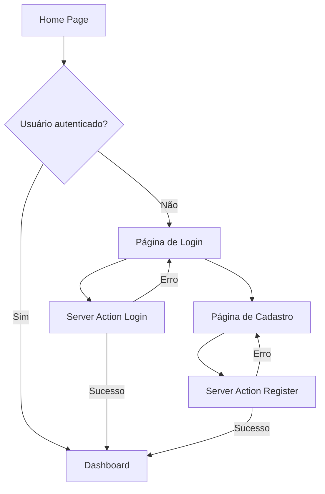

## 1. Product Overview
Sistema de autenticação para aplicação multi-tenant com Next.js e Tailwind CSS. Permite login seguro e cadastro de novos usuários com criação automática de organizações.

## 2. Core Features

### 2.1 User Roles
| Role | Registration Method | Core Permissions |
|------|---------------------|------------------|
| Usuário Comum | Cadastro via formulário | Acessar dashboard da própria organização |
| Administrador | Upgrade via convite | Gerenciar múltiplas organizações |

### 2.2 Feature Module
Nosso sistema de autenticação consiste nas seguintes páginas principais:
1. **Página de Login**: formulário de autenticação, feedback visual, redirecionamento automático.
2. **Página de Cadastro**: formulário de registro com criação de organização, validação de dados.

### 2.3 Page Details
| Page Name | Module Name | Feature description |
|-----------|-------------|---------------------|
| Página de Login | Formulário de Login | Validar email e senha, mostrar loading state, exibir erros em vermelho, redirecionar para dashboard |
| Página de Login | Server Action | Processar autenticação via Supabase, retornar erro ou redirecionar |
| Página de Login | Link de Navegação | Direcionar para página de cadastro |
| Página de Cadastro | Formulário de Registro | Capturar nome completo, nome da empresa, email e senha, validar campos obrigatórios |
| Página de Cadastro | Server Action | Criar usuário e organização no Supabase, definir role apropriado |
| Página de Cadastro | Link de Navegação | Direcionar para página de login |

## 3. Core Process
### Fluxo de Login
1. Usuário acessa `/login`
2. Preenche email e senha
3. Submete formulário via Server Action
4. Sistema valida credenciais no Supabase
5. Em caso de sucesso: redireciona para `/dashboard`
6. Em caso de erro: exibe mensagem vermelha na tela

### Fluxo de Cadastro
1. Usuário acessa `/register`
2. Preenche nome completo, nome da empresa, email e senha
3. Submete formulário via Server Action
4. Sistema cria usuário e organização no Supabase
5. Define role do usuário como administrador da organização
6. Redireciona para dashboard

## 4. User Interface Design
### 4.1 Design Style
- **Cores primárias**: bg-slate-50 (fundo), branco para cards
- **Cores de feedback**: vermelho para erros, cinza para textos secundários
- **Botões**: estilo arredondado com hover states
- **Layout**: card centralizado com sombra suave
- **Tipografia**: fonte padrão do sistema, tamanhos proporcionais

### 4.2 Page Design Overview
| Page Name | Module Name | UI Elements |
|-----------|-------------|-------------|
| Página de Login | Card Centralizado | Container com max-w-md, sombra, padding generoso, fundo branco |
| Página de Login | Formulário | Inputs com bordas arredondadas, labels claros, botão primário destacado |
| Página de Login | Estado de Loading | Botão desabilitado com texto "Entrando..." durante processamento |
| Página de Login | Mensagem de Erro | Texto vermelho abaixo do formulário, visível apenas quando houver erro |
| Página de Cadastro | Card Centralizado | Mesmo estilo do login para consistência visual |
| Página de Cadastro | Formulário | Inputs adicionais para nome e empresa, com placeholder descritivo |

### 4.3 Responsiveness
- Design desktop-first com adaptação para mobile
- Cards responsivos com largura máxima definida
- Formulários com inputs de largura total
- Espaçamento ajustável baseado em viewport